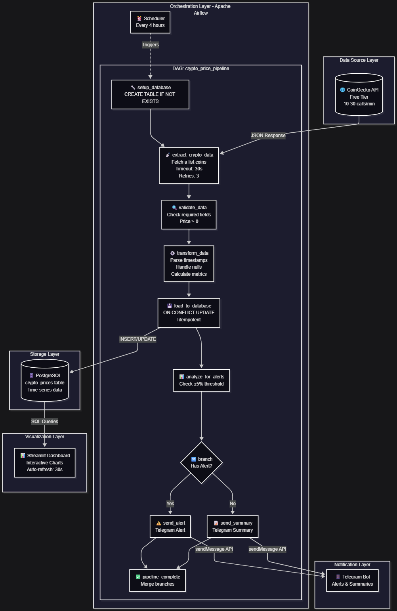

# 💰 Crypto Price Monitoring Pipeline

Hệ thống giám sát giá cryptocurrency tự động sử dụng Apache Airflow và Streamlit Dashboard.

## 📋 Tổng quan

Pipeline này:
- ✅ Thu thập giá crypto từ CoinGecko API mỗi 4 giờ
- ✅ Lưu trữ dữ liệu vào PostgreSQL
- ✅ Phân tích và gửi cảnh báo qua Telegram khi có biến động lớn (±5%)
- ✅ Hiển thị dashboard trực quan với Streamlit

**Coins được theo dõi**: Bitcoin, Ethereum, Binance Coin, Cardano, Solana, Ripple, Polkadot, Dogecoin, Shiba Inu

---

## 🎯 Yêu cầu hệ thống

- **Docker Desktop** (đã cài đặt và đang chạy)
- **Python 3.12+** (cho Streamlit dashboard)
- **Astronomer CLI** (Astro CLI)
- **Telegram Bot** (để nhận thông báo)

### Kiểm tra Docker

```bash
docker --version
docker-compose --version
```

---

## 🚀 Hướng dẫn cài đặt

### Bước 1: Cài đặt Astronomer CLI

**macOS (Homebrew)**:
```bash
brew install astro
```

**Linux**:
```bash
curl -sSL install.astronomer.io | sudo bash -s
```

**Windows**:
```powershell
winget install -e --id Astronomer.Astro
```

Kiểm tra cài đặt:
```bash
astro version
```

### Bước 2: Tạo Telegram Bot

#### 2.1. Tạo Bot với BotFather

1. Mở Telegram và tìm kiếm `@BotFather`
2. Gửi lệnh `/newbot`
3. Đặt tên cho bot (ví dụ: `Crypto Alert Bot`)
4. Đặt username (phải kết thúc bằng `bot`, ví dụ: `mycrypto_alert_bot`)
5. **Lưu lại Bot Token** (dạng: `1234567890:ABCdefGHIjklMNOpqrsTUVwxyz`)

#### 2.2. Lấy Chat ID

**Cách 1: Sử dụng bot để lấy ID**

1. Tìm và chat với bot `@userinfobot` trên Telegram
2. Bot sẽ trả về thông tin của bạn, bao gồm **Chat ID**

**Cách 2: Tạo group và lấy Group Chat ID** (khuyến nghị)

1. Tạo một Telegram group mới
2. Thêm bot của bạn vào group (tìm theo username đã tạo)
3. Gửi một tin nhắn bất kỳ trong group
4. Truy cập URL sau (thay `YOUR_BOT_TOKEN`):
   ```
   https://api.telegram.org/botYOUR_BOT_TOKEN/getUpdates
   ```
5. Tìm `"chat":{"id":-1234567890}` trong response
6. **Chat ID của group** sẽ là số âm (ví dụ: `-1234567890`)

#### 2.3. Test Telegram Bot

```bash
# Thay YOUR_BOT_TOKEN và YOUR_CHAT_ID
curl -X POST "https://api.telegram.org/botYOUR_BOT_TOKEN/sendMessage" \
  -d "chat_id=YOUR_CHAT_ID" \
  -d "text=Hello from Crypto Pipeline!"
```

Nếu thành công, bạn sẽ nhận được message trên Telegram.

### Bước 3: Clone project và cấu hình

```bash
# Clone repository (hoặc tải về project)
cd crypto-pipeline

# Tạo file .env
nano .env
```

**Nội dung file `.env`**:
```env
TELEGRAM_BOT_TOKEN=your_bot_token_here
TELEGRAM_CHAT_ID=your_chat_id_here
```

**Ví dụ**:
```env
TELEGRAM_BOT_TOKEN=8269801908:AAESP3uNBW9IIGOExVsVHPYi3Pcb_F9WAAI
TELEGRAM_CHAT_ID=-5048061023
```

### Bước 4: Cài đặt Python dependencies cho Dashboard

```bash
# Tạo virtual environment (khuyến nghị)
python3 -m venv .venv
source .venv/bin/activate  # macOS/Linux
# hoặc
.venv\Scripts\activate     # Windows

# Cài đặt packages
pip install -r requirements.txt
```

---

## 🏃 Chạy pipeline

### Bước 1: Khởi động Airflow với Astro CLI

```bash
# Trong thư mục project
astro dev init
astro dev start
```

**Lần đầu chạy sẽ mất 2-5 phút** để:
- Pull Docker images
- Khởi động 5 containers: Postgres, Scheduler, Webserver, Triggerer, DAG Processor

**Khi thấy thông báo này là thành công**:
```
Airflow Webserver: http://localhost:8080
Postgres Database: localhost:5432/postgres
```

### Bước 2: Truy cập Airflow UI

1. Mở trình duyệt: http://localhost:8080
2. **Login credentials**:
   - Username: `admin`
   - Password: `admin`

### Bước 3: Kích hoạt DAG

1. Tìm DAG `crypto_price_pipeline` trong danh sách
2. Bật toggle switch ở cột bên trái (OFF → ON)
3. Click vào tên DAG để xem chi tiết
4. **Trigger manual run** (không cần chờ schedule):
   - Click nút ▶️ (Play) ở góc trên bên phải
   - Chọn "Trigger DAG"

### Bước 4: Theo dõi DAG execution

**Graph View**:
- Click tab "Graph" để xem flow
- Các task sẽ đổi màu theo trạng thái:
  - 🟢 Xanh lá: Success
  - 🔴 Đỏ: Failed
  - 🟡 Vàng: Running
  - ⚪ Xám: Chưa chạy

**Logs**:
- Click vào một task bất kỳ
- Chọn "Logs" để xem chi tiết

### Bước 5: Kiểm tra Telegram

- Sau khi DAG chạy xong (~2-3 phút), kiểm tra Telegram
- Bạn sẽ nhận được:
  - **Alert notification** nếu có coin thay đổi > ±5%
  - **Summary notification** nếu không có alert

---

## 📊 Chạy Streamlit Dashboard

### Khởi động Dashboard

```bash
# Đảm bảo virtual environment đã được activate
source .venv/bin/activate  # macOS/Linux

# Chạy Streamlit
streamlit run dashboard/app.py
```

Dashboard sẽ tự động mở tại: http://localhost:8501

### Các tính năng Dashboard

1. **Price Cards**: Hiển thị giá hiện tại của tất cả coins
2. **Price Charts**: Biểu đồ lịch sử giá theo thời gian
3. **Alerts**: Lịch sử các cảnh báo đã kích hoạt
4. **Analysis**: Phân tích market cap, volume, correlation
5. **Pipeline Status**: Thông tin về các lần chạy pipeline

### Cấu hình Dashboard

**Sidebar Settings**:
- ✅ **Auto-refresh**: Tự động cập nhật mỗi 30 giây
- 📅 **Time Range**: Chọn khoảng thời gian hiển thị (24h - 30 ngày)
- 👁️ **View Mode**: Cards, Table, hoặc Both

---

## 🛠️ Các lệnh Astro CLI hữu ích

### Quản lý containers

```bash
# Xem trạng thái containers
astro dev ps

# Dừng tất cả containers
astro dev stop

# Khởi động lại
astro dev restart

# Dừng và xóa containers (reset hoàn toàn)
astro dev kill
```

### Xem logs

```bash
# Logs của scheduler
astro dev logs -f -s scheduler

# Logs của webserver
astro dev logs -f -s webserver

# Logs tất cả services
astro dev logs -f
```

### Truy cập Airflow CLI

```bash
# Chạy Airflow commands
astro dev run dags list
astro dev run tasks test crypto_price_pipeline extract_crypto_data 2024-12-01
```

### Truy cập PostgreSQL

```bash
# Kết nối vào database
astro dev run psql

# Hoặc sử dụng client bên ngoài
# Host: localhost
# Port: 5432
# Database: postgres
# User: postgres
# Password: postgres
```

**Queries hữu ích**:
```sql
-- Xem tất cả dữ liệu
SELECT * FROM crypto_prices ORDER BY execution_date DESC LIMIT 10;

-- Đếm số records
SELECT COUNT(*) FROM crypto_prices;

-- Xem giá mới nhất của mỗi coin
SELECT DISTINCT ON (coin_id) 
    coin_id, symbol, current_price, price_change_percentage_24h
FROM crypto_prices
ORDER BY coin_id, execution_date DESC;
```

---

## 🔧 Troubleshooting

### 1. Lỗi "Port 8080 already in use"

```bash
# Tìm process đang dùng port
lsof -i :8080  # macOS/Linux
netstat -ano | findstr :8080  # Windows

# Hoặc đổi port trong Astro
astro config set webserver.port 8081
```

### 2. DAG không xuất hiện trong UI

```bash
# Parse DAG để kiểm tra syntax
astro dev run dags list

# Xem import errors
astro dev run dags show crypto_price_pipeline

# Restart scheduler
astro dev restart -s scheduler
```

### 3. Telegram không nhận được notification

**Kiểm tra credentials**:
```bash
# In environment variables trong Airflow
astro dev run printenv | grep TELEGRAM
```

Nếu không thấy, thêm vào `Dockerfile`:
```dockerfile
FROM astrocrpublic.azurecr.io/runtime:3.1-7

# Thêm environment variables
ENV TELEGRAM_BOT_TOKEN="your_token"
ENV TELEGRAM_CHAT_ID="your_chat_id"
```

Sau đó rebuild:
```bash
astro dev restart
```

### 4. Database connection error

```bash
# Kiểm tra Postgres container
docker ps | grep postgres

# Test connection
astro dev run psql -c "SELECT 1"

# Restart Postgres
astro dev restart -s postgres
```

### 5. CoinGecko API rate limit

Nếu gặp lỗi `429 Too Many Requests`:
- Free API có giới hạn ~10-30 calls/phút
- Giảm số coins trong `COIN_IDS` (file `dags/crypto_pipeline_dag.py`)
- Hoặc tăng schedule interval (ví dụ: mỗi 8 giờ thay vì 4 giờ)

```python
# Trong crypto_pipeline_dag.py
schedule='0 */8 * * *',  # Chạy mỗi 8 giờ
```

### 6. Dashboard không kết nối được database

Nếu chạy dashboard ngoài Docker:

**Thay đổi trong `dashboard/utils/db_client.py`**:
```python
DB_CONFIG = {
    'host': 'localhost',  # Thay vì 'postgres'
    'port': 5432,
    'database': 'postgres',
    'user': 'postgres',
    'password': 'postgres'
}
```

---

## 📁 Cấu trúc project

```
crypto-pipeline/
├── dags/
│   ├── crypto_pipeline_dag.py      # Main DAG definition
│   └── exampledag.py                # Example DAG từ Astronomer
├── include/
│   ├── api_utils.py                 # CoinGecko API functions
│   ├── db_utils.py                  # Database operations
│   ├── notification_utils.py        # Telegram notifications
│   └── sql/
│       └── create_table.sql         # Database schema
├── dashboard/
│   ├── app.py                       # Streamlit main app
│   ├── components/                  # UI components
│   │   ├── price_cards.py
│   │   ├── charts.py
│   │   └── alerts.py
│   └── utils/                       # Dashboard utilities
│       ├── db_client.py
│       └── formatters.py
├── Dockerfile                       # Astro Runtime base image
├── requirements.txt                 # Python dependencies
├── .env                            # Environment variables (local only)
└── README.md                        # Documentation này
```

---

## 🔄 DAG Schedule & Flow

### Schedule
- **Cron**: `0 */4 * * *` (mỗi 4 giờ, vào phút 0)
- **Thời điểm chạy**: 00:00, 04:00, 08:00, 12:00, 16:00, 20:00 UTC

### Flow

### Thời gian thực thi
- **Bình thường**: 1-2 phút
- **Có retry**: 5-10 phút (nếu API chậm)

---
**Chúc bạn thành công! 🚀**